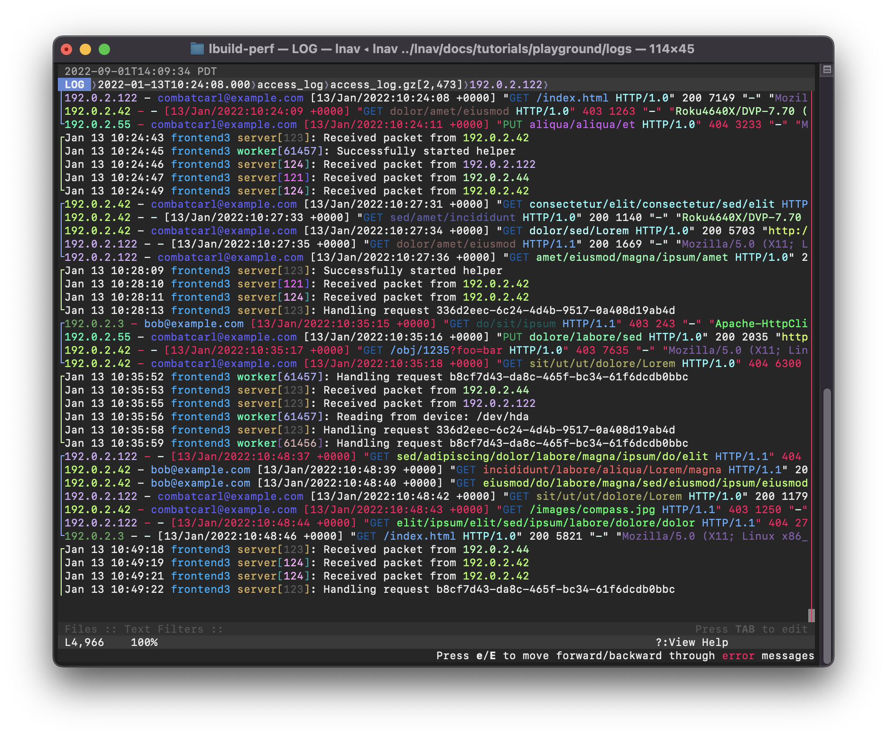

# nlnav — The Logfile Navigator (custom fork)

A fork of [lnav](https://lnav.org) with added features for log analysis and security investigation.

---

## Added Features

### Timestamp Normalization

Normalize all displayed log timestamps to UTC `YYYY-MM-DD HH:MM:SS[.sss]` format, regardless of the original timezone or format in the file.

| Interface | How to use |
|---|---|
| Key | Press `y` to toggle on/off |
| Command | `:normalize-timestamps [on\|off]` |
| SQL | `SELECT normalize_ts('2024-03-25T10:30:00-05:00')` → `2024-03-25 15:30:00` |

Useful when comparing logs from machines in different timezones or with mixed timestamp formats (e.g. syslog + ISO 8601 in the same file).

---

### SSH Traffic Flow Map

Press `0` to open an SSH statistics panel built from the currently loaded log files.

| Interface | How to use |
|---|---|
| Key | Press `0` to toggle the panel |
| Command | `:ssh-stats` |

The panel shows three sections:

1. **SSH Traffic Flow Map** — per-source-IP flow table with destination, outcome, authenticated user(s), and auth method (e.g. `public key`, `SSSD (LDAP/AD)`, `Kerberos/GSSAPI`, `MFA/Duo`, etc.)
2. **SSH Event Summary** — counts of accepted, failed, invalid-user, disconnected, and other event types
3. **IP Address Frequency** — all IPs extracted from logs, split into **Public** and **Private** sub-groups

Supports both BSD syslog (`Mar 25 HH:MM:SS host sshd[pid]: ...`) and ISO syslog (`2026-03-25T13:03:20+00:00 host sshd[pid]: ...`) formats.

---

### IOC Highlighting (`--ioc`)

Flag known malicious IPs from a threat-intel file and have them highlighted in both the log view and SSH stats panel.

```console
$ lnav --ioc /path/to/ioc.txt /var/log/auth.log
```

The IOC file is plain text — one or more IPv4 addresses per line, `#` comments supported. Matching IPs are highlighted with a dark background (`#2e3440`) in the log view and in the SSH flow/IP-frequency tables.

---

## What lnav Does

Given a set of files or directories, **lnav** will:

- decompress as needed;
- detect their format;
- merge the files by time into a single view;
- tail the files, follow renames, find new files in directories;
- build an index of errors and warnings;
- pretty-print JSON-lines.

Then, in the TUI, you can:

- jump quickly to the previous/next error (press `e`/`E`);
- search using regular expressions (press `/`);
- highlight text with a regular expression (`:highlight` command);
- filter messages using regular expressions or SQLite expressions;
- pretty-print structured text (press `P`);
- view a histogram of messages over time (press `i`);
- analyze messages using SQLite (press `;`).

## Screenshot

[](docs/assets/images/lnav-front-page.png)

## Installation

### Build from source

#### Prerequisites

- gcc/clang (C++14-compatible)
- libpcre2
- sqlite ≥ 3.9.0
- zlib, bz2
- libcurl ≥ 7.23.0
- libarchive
- libunistring
- wireshark (`tshark`, for pcap support)
- cargo/rust (for PRQL compiler)

#### Build

```console
$ ./autogen.sh    # only needed when building from a git clone
$ ./configure
$ make
$ sudo make install
```

## Usage

```console
$ lnav /path/to/file1 /path/to/dir ...
$ lnav --ioc /path/to/ioc.txt /var/log/auth.log
```

See the [upstream documentation](https://docs.lnav.org) for full usage details.

### Usage with `systemd-journald`

```console
$ journalctl | lnav
$ journalctl -f | lnav
$ journalctl -o short-iso | lnav   # include year in timestamps
$ journalctl -o json | lnav        # structured fields (PRIORITY, _SYSTEMD_UNIT, etc.)
```

## Upstream

This fork is based on [tstack/lnav](https://github.com/tstack/lnav).
For issues with base lnav functionality, refer to the upstream project.
